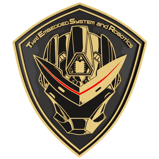

<div align="center">



# TESR Vision Lab

**ปรับค่า OpenCV บนเว็บ แล้วรับโค้ด Python ไปรันบน Edge Device ได้ทันที**
*Tune OpenCV in the browser, then take the Python code straight to your edge device*

Thai Embedded System and Robotics (TESR) · MIT License

</div>

---

## เครื่องมือนี้คืออะไร

ไฟล์ HTML ไฟล์เดียว ที่รวมงาน Image Processing พื้นฐานของหลักสูตร TESR ไว้ในหน้าเดียว
ผู้เรียนเลื่อน slider ดูผลทันทีในเบราว์เซอร์ แล้วกดปุ่มเดียวเพื่อได้ไฟล์ `.py` ที่ใช้ค่าเดียวกัน
พร้อมรันบน PC, Raspberry Pi 5 หรือ NVIDIA Jetson

ประมวลผลด้วย **OpenCV.js (WebAssembly)** ในเครื่องผู้ใช้ทั้งหมด — ไม่มีการอัปโหลดภาพขึ้นเซิร์ฟเวอร์

| โหมด | ครอบคลุมสคริปต์เดิม |
|---|---|
| **วงกลม (Hough)** | `CircleDetectionFromImageEX1/2/3.py`, `CircleDetectionFromImage_GUI.py` |
| **สี (HSV)** | `ColorDetection.py`, `ColorDetection2.py`, `ColorDetection3.py`, `ColorDetection_with_GUI.py` |
| **ภาพพื้นฐาน** | Gray → Blur → Threshold → Morphology → Canny → Contour |
| **เส้นตรง (Hough)** | `Canny_Edge.py`, `CannyEdge_With_GUI.py`, `HoughLine.py`, `HoughLine__GUI.py`, `HoughLineP.py`, `HoughLineP__GUI.py` |
| **วาด & ข้อความ** | `Drawing_Line.py`, `Drawing_Rectangle.py`, `Drawing_Circle.py`, `Put_Text.py` |
| **Haar Cascade** | `EyesDetectionusingHaarCascades.py`, `EyesDetectionWithWebcam.py`, `EyesDetectionWithKinect.py` |
| **Face Recognition** | ต่อยอดจาก Haar — ลงทะเบียนใบหน้า เทรน LBPH แล้วรู้จำ |

สคริปต์ต้นฉบับทั้ง 19 ไฟล์เก็บไว้ที่ `python/` เพื่ออ้างอิงระหว่างสอน

---

## ความสามารถ

- **Live Streaming** — เปิดกล้องแล้วประมวลผลทุกเฟรมตามแท็บที่เลือกอยู่ (วงกลม สี เส้น Haar Face Recognition ได้หมด) แสดง fps ของเบราว์เซอร์ มีปุ่ม "พักภาพ" เพื่อหยุดภาพชั่วคราวไว้คลิกดูดสี และ "จับภาพนิ่ง" เพื่อเก็บเฟรมนั้นมาปรับต่อละเอียด ๆ
- ปรับพารามิเตอร์เห็นผลทันที เทียบภาพต้นฉบับกับผลลัพธ์แบบคู่กัน
- **ดูดสีจากภาพด้วยการคลิก** — อ่านค่า BGR / HSV แล้วตั้งค่า slider ให้อัตโนมัติ (แทน `mouseClickRGB` ในสคริปต์เดิม)
- รองรับ **hue wrap-around** สำหรับสีแดง ซึ่งช่วง H คร่อมค่า 0 — ปัญหาที่โค้ดแบบ `HSV ± thresh` ตรง ๆ แก้ไม่ได้
- ตารางผลลัพธ์รายวัตถุ (x, y, radius, area) และจำนวนที่นับได้
- **วาดรูปทรงและข้อความ** ด้วยการคลิกกำหนดจุดบนภาพ เก็บพิกัดเป็นสัดส่วน 0–1 ของขนาดภาพ ย้ายไปกล้องความละเอียดอื่นก็ยังวางถูกตำแหน่ง
- **Canny + Hough Lines** ปรับ threshold ของ Canny และพารามิเตอร์ของ `HoughLines` / `HoughLinesP` ในหน้าเดียว สลับดูภาพขอบกับเส้นที่ได้
- **กรองเส้นตามมุม** (0 = แนวนอน, 90 = แนวตั้ง) สำหรับงานหาเส้นตีพื้นโรงงาน ขอบสายพาน หรือกรอบชิ้นงาน
- **Face Recognition** ลงทะเบียนใบหน้าในเบราว์เซอร์ (LBP histogram + chi-square) ปรับ threshold เห็นผลทันที แล้ว generate สคริปต์ Python ที่ใช้ `cv2.face.LBPHFaceRecognizer` ครบทั้ง 3 โหมด: `--mode enroll` → `--mode train` → `--mode recognize`
- **Haar Cascade** สำหรับดวงตา ใบหน้า และรอยยิ้ม พร้อมโหมด **face ROI** — หาใบหน้าก่อนแล้วค้นหาเฉพาะในกรอบใบหน้า ซึ่งตัด false positive ได้มากกว่าการค้นทั้งภาพ
- สร้างโค้ด Python ตามอุปกรณ์ปลายทาง
  - PC / Notebook → `cv2.VideoCapture`
  - Raspberry Pi 5 → `Picamera2`
  - NVIDIA Jetson → GStreamer `nvarguscamerasrc` พร้อม fallback ไป USB camera
  - Kinect v1 → `freenect.sync_get_video()`
- แหล่งภาพในโค้ด: ไฟล์ภาพ / กล้องเรียลไทม์ / ไฟล์วิดีโอ
- ตัวเลือกเสริม: แสดง FPS, บันทึกภาพผลลัพธ์, ส่งผลออก **MQTT** เพื่อต่อ Node-RED หรือ Dashboard
- คอมเมนต์ไทย/อังกฤษ, สลับ UI ไทย/อังกฤษ
- โค้ด Python แสดงเต็มในหน้าเดียวกัน อัปเดตตามค่าที่ปรับแบบเรียลไทม์ กด **คัดลอก** หรือ **ดาวน์โหลด .py** ได้ทันที พร้อม `requirements.txt` และบันทึกภาพผลลัพธ์
- ใช้กล้องเว็บแคมจับภาพนิ่งมาปรับค่าได้ทันที

---

## วิธีใช้งาน

### รันในเครื่อง

ต้องเปิดผ่าน HTTP server (ไม่ใช่ดับเบิลคลิกไฟล์) เพราะเบราว์เซอร์จะบล็อกการอ่านพิกเซลจาก `file://`

```bash
git clone https://github.com/<your-account>/tesr-vision-lab.git
cd tesr-vision-lab
python -m http.server 8000
# เปิด http://localhost:8000
```

การลากไฟล์ภาพมาวางใช้ได้ทุกกรณี แม้เปิดแบบ `file://`

### Deploy ขึ้น GitHub Pages

1. สร้าง repository ใหม่แล้ว push โฟลเดอร์นี้ขึ้นไป
2. ไปที่ **Settings → Pages → Build and deployment → Source: GitHub Actions**
3. Workflow ใน `.github/workflows/deploy.yml` จะ deploy ให้อัตโนมัติทุกครั้งที่ push เข้า `main`
4. เว็บจะขึ้นที่ `https://<your-account>.github.io/tesr-vision-lab/`

### ใช้งานแบบออฟไลน์เต็มรูปแบบ

ค่าเริ่มต้นโหลด `opencv.js` และฟอนต์จาก CDN ถ้าต้องใช้ในห้องอบรมที่ไม่มีอินเทอร์เน็ต

1. ดาวน์โหลด `opencv.js` จาก https://docs.opencv.org/4.10.0/opencv.js มาไว้ที่ `assets/opencv.js`
2. แก้ค่า `CDNS` ใน `index.html` เป็น

```js
const CDNS = ['assets/opencv.js'];
```

3. (ถ้าต้องการ) ดาวน์โหลดฟอนต์ Kanit และ Sarabun มาไว้ในเครื่อง แล้วแก้ `<link>` ของ Google Fonts

---

## โครงสร้างโฟลเดอร์

```
tesr-vision-lab/
├── index.html              เครื่องมือทั้งหมดอยู่ในไฟล์เดียว
├── assets/logo.png         โลโก้ TESR
├── assets/cascades/        ไฟล์ Haar Cascade สำหรับให้ OpenCV.js ใช้ในเบราว์เซอร์
├── samples/                ภาพตัวอย่างจากหลักสูตร
├── python/                 สคริปต์ต้นฉบับ 19 ไฟล์สำหรับอ้างอิงในคลาส
├── .github/workflows/      GitHub Pages deployment
├── LICENSE
└── README.md
```

---

## ข้อจำกัดที่ต้องบอกผู้เรียนทุกครั้ง

- **เวลาที่แสดงในหน้าเว็บคือเวลาของ OpenCV.js บนเครื่องที่เปิดหน้านั้น ไม่ใช่ผลทดสอบของ Raspberry Pi หรือ Jetson**
  ต้องวัดซ้ำบนอุปกรณ์จริงเสมอ เครื่องมือนี้ไม่ได้ให้ตัวเลข benchmark ของ Edge Device
- ค่าที่จูนจากภาพนิ่งใช้กับกล้องจริงได้ไม่ตรงเสมอไป แสง ระยะกล้อง เลนส์ และ white balance เปลี่ยน ต้องจูนใหม่
- Hough Circle และ HSV threshold เป็นวิธีเชิงกฎ (rule-based) เหมาะกับฉากที่ควบคุมได้
  ถ้าวัตถุซ้อนทับ พื้นหลังรก หรือแสงแปรปรวนมาก ให้ขยับไปใช้โมเดล Deep Learning เช่น YOLO
- ค่า HSV ของ OpenCV คือ H 0–179, S 0–255, V 0–255 ไม่ใช่ 0–360 แบบทั่วไป
- `cv2.HoughCircles` คืนค่า `(x, y, radius)` — ค่าที่สามคือ **รัศมี** ไม่ใช่เส้นผ่านศูนย์กลาง
- Haar Cascade ไวต่อแสง มุมหน้า และแว่นตา ถึงตั้ง `minNeighbors` สูงก็ยังมีผลลวง
  งานที่ต้องการความแม่นยำจริงควรใช้โมเดล Deep Learning เช่น YOLO, SSD หรือ MediaPipe Face Mesh
- `cv2.Canny` รับ `apertureSize` ได้เฉพาะ 3, 5, 7 ค่าอื่นโยน error ทันที (trackbar ที่เลื่อนได้ 1–10 จะทำให้โปรแกรมพัง)
- `cv2.HoughLines` คืน `(rho, theta)` ซึ่งเป็นเส้นยาวไม่จำกัด ต้องแปลงเป็นสองจุดเองก่อนวาด ส่วน `cv2.HoughLinesP` คืนจุดปลายจริงจึงวัดความยาวได้
- `cv2.putText` วาดภาษาไทยไม่ได้ ถ้าต้องแสดงข้อความไทยบนภาพต้องวาดผ่าน PIL แล้วแปลงกลับเป็น NumPy array

### เรื่อง Face Recognition

- โหมดในเบราว์เซอร์ใช้ LBP histogram เทียบด้วย chi-square ซึ่งเป็น**คนละ implementation**กับ `cv2.face.LBPHFaceRecognizer` ค่าระยะทางจึงไม่เท่ากัน ให้ใช้เบราว์เซอร์ดูพฤติกรรม แล้วไปจูน threshold จริงบนเครื่องปลายทาง
- ใบหน้าที่ลงทะเบียนในเว็บอยู่ในหน่วยความจำของแท็บเท่านั้น ปิดหน้าเว็บแล้วหาย ไม่มีการอัปโหลดหรือเขียนลงดิสก์
- ค่า `confidence` ของ LBPH คือ**ระยะห่าง ยิ่งน้อยยิ่งเหมือน** ไม่ใช่เปอร์เซ็นต์ความมั่นใจ — เป็นจุดที่เข้าใจผิดกันบ่อยที่สุด
- ต้องใช้ `opencv-contrib-python` เพราะ `cv2.face` อยู่ในโมดูล contrib และ**ห้ามติดตั้งคู่กับ `opencv-python`** ให้ถอนตัวเดิมออกก่อน
- LBPH ไวต่อมุมหน้า แสง และแว่นตามาก เหมาะกับงานสาธิตและ Proof of Concept ในสภาพแวดล้อมที่ควบคุมได้
  งานลงทะเบียนเข้า-ออกจริงควรใช้ face embedding เช่น ArcFace หรือ InsightFace ที่ทนต่อการเปลี่ยนแปลงได้ดีกว่ามาก

### เรื่องภาพใบหน้า

รีโพนี้ **ไม่ได้แถมภาพใบหน้าตัวอย่าง** เพราะภาพบุคคลมีทั้งเรื่องลิขสิทธิ์และ PDPA
เวลาสอนให้ใช้ปุ่มเปิดกล้องจับภาพ หรือให้ผู้เรียนใช้ภาพของตัวเอง
ถ้าจะเก็บหรือบันทึกภาพใบหน้าในระบบจริง ต้องแจ้งวัตถุประสงค์และขอความยินยอมตาม PDPA ก่อนเสมอ

### ไฟล์ Haar Cascade

ไฟล์ใน `assets/cascades/` มาจากโปรเจกต์ OpenCV (`opencv/data/haarcascades`)
อยู่ภายใต้สัญญาอนุญาตของ Intel/OpenCV ที่ระบุไว้ในส่วนหัวของไฟล์ XML เอง ห้ามลบส่วนหัวนั้นออก
ในฝั่ง Python โค้ดที่สร้างจะอ่านไฟล์จาก `cv2.data.haarcascades` ซึ่งติดตั้งมากับ `opencv-python` อยู่แล้ว
จึงไม่ต้องแก้ path เวลาย้ายเครื่อง

---

## ต่อยอด

- ใช้เป็น Lab เปิดคลาสก่อนเข้าเนื้อหา YOLO และ Deep Learning ใน TESR Academy
- ใช้สาธิตหน้างานลูกค้า ปรับค่าสด ๆ แล้วส่งไฟล์ `.py` ให้ทีมลูกค้าไปทดสอบต่อ
- ต่อผลลัพธ์เข้า MQTT → Node-RED → Dashboard เป็น Proof of Concept ของงานนับชิ้นงานหรือคัดแยกสี

---

## License

MIT © TESR Co., Ltd. (Thai Embedded System and Robotics)

โลโก้และเครื่องหมายการค้าของ TESR ไม่รวมอยู่ในสัญญาอนุญาต MIT
